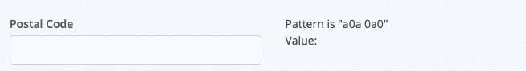
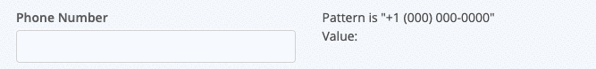
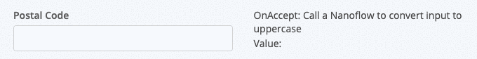
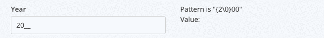

## IMaskWeb

The missing masked input for Mendix, based on https://imask.js.org/

## Features
* Apply a mask to your input to improve user experience when entering formatted values like postal codes, phone numbers, and order numbers
* Overwrite mode
* Lazy (hidden) masking
* Custom placeholder characters
* Custom mask character definitions

## Usage
1. Install the widget in your project.
2. Place the widget on a page
3. Connect an attribute, and enter a mask pattern, using the guide included (or view the full options here: https://imask.js.org/guide.html#masked-pattern)

## Demo 

Canadian Postal Code

US Phone Number

OnAccept event

Include fixed region in unmasked value:

## Issues, suggestions and feature requests

Please open an issue here: https://github.com/cdcharlebois/imask-web/issues

## Development and contribution

Roadmap:

* Custom Mask blocks (max/min, pattern, etc)
* Dynamic Mask patterns (based on expression)
* Save the masked value

Currently accepting pull requests